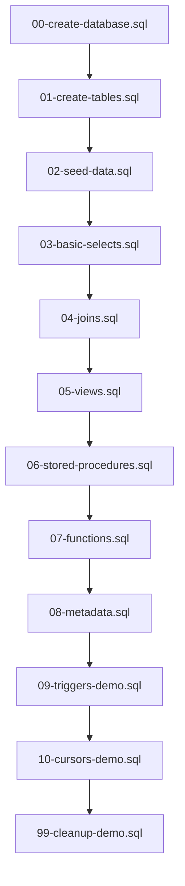
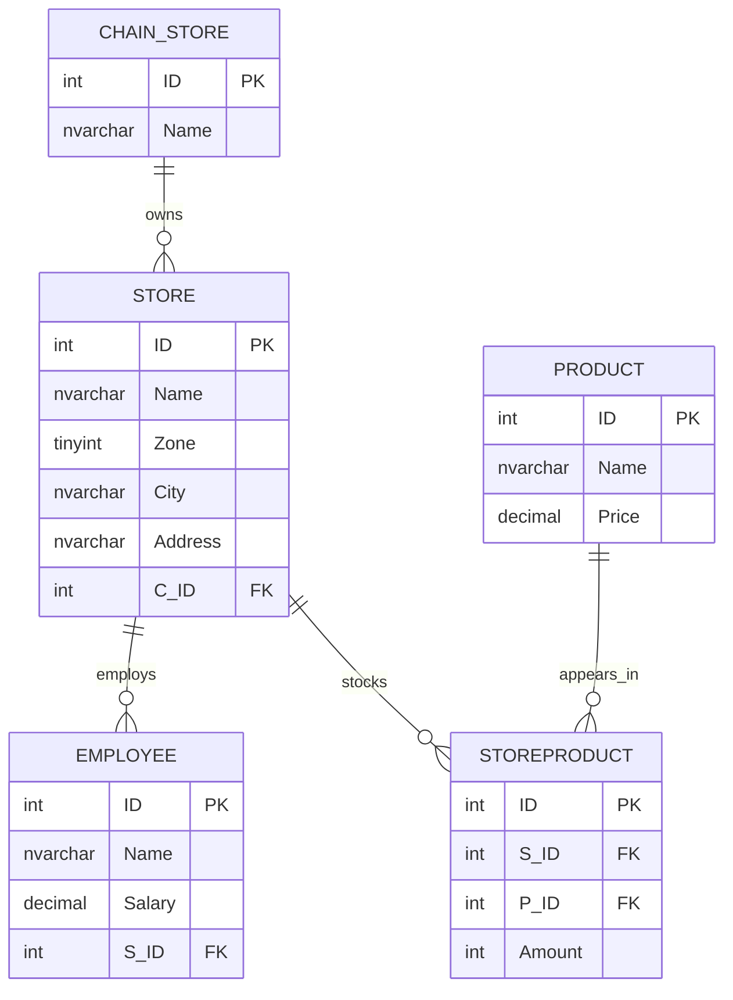

# SQL Server Tutorial

<p align="right">
  <a href="./README.md"> English</a> |
  <a href="./README.fa.md">فارسی</a>
</p>

> [!IMPORTANT]
> The English file should be the primary maintained README for this repository, with the Persian file kept as a translated companion. GitHub automatically surfaces a README from `.github`, the repository root, or `docs`, and GitHub recommends relative links for links between repository files. citeturn10view4turn11view2

## Executive Summary

This README is a professionally reviewed English rewrite of the original Persian tutorial in this repository. It preserves the original educational scope—table creation, sample inserts, basic `SELECT` queries, joins, views, stored procedures, functions, triggers, and cursors—while correcting problems in the source notes, including a trailing comma in `StoreProduct`, an incorrect join condition in the multi-table join and `vwEmployee`, a stored procedure that references a missing `CategoryID` column, a legacy `sys.syscomments` example, a trigger test insert without a column list, and a cursor example that stores salary values in `bigint` instead of a decimal type. fileciteturn0file0L5-L75 fileciteturn0file0L211-L258 fileciteturn0file0L299-L402 fileciteturn0file0L583-L660 fileciteturn0file0L682-L780

The guidance below prioritizes official documentation from entity["company","Microsoft","software company"] and is formatted for practical use on entity["company","GitHub","developer platform"]. The revised examples assume **SQL Server 2016 SP1 or later**, because they use `CREATE OR ALTER` for views, procedures, functions, and triggers. If you are using an older version, replace those statements with `DROP ...` plus `CREATE ...` patterns. citeturn18view0turn6search1turn6search0turn9view6turn6search2

This tutorial uses Persian sample data intentionally to demonstrate Unicode-safe inserts into `NVARCHAR` columns. In SQL Server, Unicode string literals should be prefixed with `N` when you want them interpreted as `nvarchar` values rather than non-Unicode string constants. fileciteturn0file0L76-L158 citeturn9view2

> [!WARNING]
> Two examples in this tutorial are intentionally disruptive and should be treated as **demo-only**: the database-level DDL trigger (`tr_blickcreate`) and the `INSTEAD OF INSERT` trigger on `Product` (`tr_notInsert`). DDL triggers fire after the triggering DDL statement and can roll back schema changes, and both DML and DDL triggers come with real security considerations if you allow untrusted trigger creation or modification. fileciteturn0file0L583-L660 citeturn9view15turn16view0

## Language Switcher and README Conventions

A multilingual repository is easiest to maintain when the default `README.md` is English and the translated companion lives beside it—for example, `README.fa.md`. GitHub surfaces the root README prominently and recommends relative links for navigation between files, which makes a simple in-file language switcher a reliable approach for both the web UI and cloned repositories. citeturn10view4turn11view2

Use this switcher at the top of both files:

```html
<p align="right">
  <a href="./README.md">🇺🇸 English</a> |
  <a href="./README.fa.md">🇮🇷 فارسی</a>
</p>
```

If you want badges, keep them optional and lightweight. GitHub READMEs commonly use badges, and Shields supports static badges that can be embedded directly in Markdown. citeturn8search1turn8search2turn8search12

```md
[](./README.md)
[](./README.fa.md)
[](#sql-server-tutorial)
```

A good GitHub README should explain what the project does, why it is useful, how to get started, and where to go next. GitHub also auto-generates an outline from headings, so a clean heading structure improves navigation automatically. citeturn10view4turn10view5

## Object Inventory

The original tutorial defined a compact chain-store schema plus a set of derived objects and demonstrations. The table below classifies each object by purpose and whether it is safe to run in a normal demo database without intentionally blocking behavior or requiring schema changes beyond the currently defined tables. The classification is based on the original Persian file and on official SQL Server behavior for modules, triggers, and metadata objects. fileciteturn0file0L5-L780 citeturn9view15turn9view8turn9view9turn9view10

| Name | Purpose | Safe to run | Notes |
|---|---|---:|---|
| `dbo.Product` | Stores products and prices | Yes | Add `CHECK (Price > 0)` for integrity |
| `dbo.Chain_Store` | Stores chain brands | Yes | Parent table for `Store` |
| `dbo.Store` | Stores branches/locations | Yes | References `Chain_Store` |
| `dbo.Employee` | Stores employees and salaries | Yes | References `Store`; salary should stay decimal |
| `dbo.StoreProduct` | Bridge table between stores and products | Yes | Original script had a trailing comma; add `UNIQUE (S_ID, P_ID)` |
| `dbo.vwEmployee` | Store/chain/employee reporting view | Yes | Must use corrected join logic |
| `dbo.vw_storeEmployeeCount` | Employee count by store | Yes | Safe aggregate view |
| `dbo.vwStoreName` | Distinct store names | Yes | `WITH ENCRYPTION` is optional and comes with caveats |
| `dbo.GetAllProducts` | Returns all products | Yes | Read-only procedure |
| `dbo.GetProductsByPriceRange` | Filters products by price band | Yes | Read-only procedure |
| `dbo.GetProductCount` | Returns total product count through output param | Yes | Safe procedure |
| `dbo.GetProductsByCategory` | Optional-parameter demo | No | Current schema does not define `Product.CategoryID` |
| `dbo.UpdateProductPrice` | Updates product price | Yes | Use guarded version with `TRY...CATCH` and `THROW` |
| `dbo.CalculateTax` | Scalar tax calculation | Yes | Safe educational scalar UDF |
| `dbo.GetEmployeeCount` | Scalar store employee count | Yes | Safe educational scalar UDF |
| `dbo.GetStoreProducts` | Inline TVF for store inventory | Yes | Safe inline table-valued function |
| `dbo.GetLowStockProducts` | Inline TVF for low stock lookup | Yes | Safe inline table-valued function |
| `dbo.GetStoreSummary` | Multi-statement TVF with store rollup | Yes | Safe if tables and data exist |
| `tr_blickcreate` | Blocks `CREATE_TABLE` / `ALTER_TABLE` / `DROP_TABLE` | No | Demo-only, intentionally disruptive |
| `dbo.tr_notInsert` | Replaces normal inserts to `Product` | No | Demo-only, intentionally suppresses inserts |

The most important corrections are these. First, the original `StoreProduct` definition has a trailing comma before the closing parenthesis, which must be removed. Second, the original multi-table join and `vwEmployee` both join `Chain_Store` directly to `Employee` on `ID = ID`, which does not match the foreign-key design of the schema; the correct path is `Chain_Store -> Store -> Employee`. Third, the original optional-parameter procedure references `CategoryID`, but the original `Product` table does not define that column. Fourth, the original metadata example uses `sys.syscomments`, which Microsoft explicitly says not to use for new development. fileciteturn0file0L62-L70 fileciteturn0file0L238-L258 fileciteturn0file0L341-L349 fileciteturn0file0L400-L401 citeturn9view9turn9view10turn9view11

## Safe Script Layout and Execution Order

A safe repository layout separates schema creation, sample data, read-only examples, and demo-only behaviors. This is especially useful because foreign keys create ordering requirements, and SQL Server requires `CREATE VIEW`, `CREATE PROCEDURE`, and `CREATE TRIGGER` to lead their own batches. `CREATE OR ALTER` also helps make repeated executions more predictable on supported versions. citeturn9view1turn17view3turn19search2turn20view2turn18view0turn6search1turn9view6

Recommended structure:

```text
scripts/
  00-create-database.sql          -- optional: create demo database and USE it
  01-create-tables.sql            -- base tables, PK/FK/CHECK/UNIQUE constraints
  02-seed-data.sql                -- sample Persian data with N-prefixed literals
  03-basic-selects.sql            -- SELECT, WHERE, LIKE, BETWEEN, GROUP BY
  04-joins.sql                    -- single-table and multi-table join examples
  05-views.sql                    -- vwEmployee, vw_storeEmployeeCount, vwStoreName
  06-stored-procedures.sql        -- stored procedure examples
  07-functions.sql                -- scalar, inline TVF, multi-statement TVF
  08-metadata.sql                 -- sys.objects, sys.triggers, sys.sql_modules, OBJECT_DEFINITION
  09-triggers-demo.sql            -- demo-only trigger examples
  10-cursors-demo.sql             -- cursor demo and set-based comparison
  99-cleanup-demo.sql             -- optional drop/reset script for a disposable lab database
```

Because GitHub supports Mermaid diagrams in fenced `mermaid` code blocks, the execution order below will render directly in a README. citeturn13search0turn13search2



Run the trigger script last and only in a disposable lab environment. The DDL trigger can block later schema changes, and the `INSTEAD OF INSERT` trigger intentionally changes expected insert behavior. Triggers are enabled by default when created, and they can later be disabled or re-enabled explicitly if needed. citeturn9view15turn9view8turn2search4

## Schema and Sample Data

The original tutorial models a retail chain: a chain owns stores, stores employ people, and stores stock products through a many-to-many bridge table. That basic design is sound and maps directly to SQL Server primary-key and foreign-key constraints. The improvements below add explicit schema names, integrity constraints, and Unicode-safe sample data handling. fileciteturn0file0L5-L158 citeturn9view1turn14view2turn7search0turn14view4turn14view5turn9view2



### Table Creation

`IDENTITY` auto-generates numeric values, but it does **not** guarantee uniqueness by itself; uniqueness is enforced by the primary-key constraint. `DECIMAL(10,2)` means 10 total digits with 2 digits to the right of the decimal point. `CHECK` constraints are a simple, first-class way to enforce positive inventory, salary, and price rules. citeturn9view0turn7search0turn14view4turn14view5turn14view2

#### Product

```sql
CREATE TABLE dbo.Product (
    ID INT IDENTITY(1,1) NOT NULL
        CONSTRAINT PK_Product PRIMARY KEY,
    Name NVARCHAR(100) NOT NULL,
    Price DECIMAL(10,2) NOT NULL
        CONSTRAINT CK_Product_Price CHECK (Price > 0)
);
```

#### Chain Store

```sql
CREATE TABLE dbo.Chain_Store (
    ID INT IDENTITY(1,1) NOT NULL
        CONSTRAINT PK_Chain_Store PRIMARY KEY,
    Name NVARCHAR(100) NOT NULL
);
```

#### Store

```sql
CREATE TABLE dbo.Store (
    ID INT IDENTITY(1,1) NOT NULL
        CONSTRAINT PK_Store PRIMARY KEY,
    Name NVARCHAR(100) NOT NULL,
    Zone TINYINT NOT NULL,
    City NVARCHAR(100) NOT NULL,
    Address NVARCHAR(100) NOT NULL,
    C_ID INT NOT NULL
        CONSTRAINT FK_Store_ChainStore
        REFERENCES dbo.Chain_Store(ID)
);
```

#### Employee

```sql
CREATE TABLE dbo.Employee (
    ID INT IDENTITY(1,1) NOT NULL
        CONSTRAINT PK_Employee PRIMARY KEY,
    Name NVARCHAR(100) NOT NULL,
    Salary DECIMAL(10,2) NOT NULL
        CONSTRAINT CK_Employee_Salary CHECK (Salary >= 0),
    S_ID INT NOT NULL
        CONSTRAINT FK_Employee_Store
        REFERENCES dbo.Store(ID)
);
```

#### StoreProduct

The original file had a trailing comma before `)`, which would cause a syntax error. The corrected script also prevents duplicate store/product pairs. fileciteturn0file0L62-L70

```sql
CREATE TABLE dbo.StoreProduct (
    ID INT IDENTITY(1,1) NOT NULL
        CONSTRAINT PK_StoreProduct PRIMARY KEY,
    S_ID INT NOT NULL
        CONSTRAINT FK_StoreProduct_Store
        REFERENCES dbo.Store(ID),
    P_ID INT NOT NULL
        CONSTRAINT FK_StoreProduct_Product
        REFERENCES dbo.Product(ID),
    Amount INT NOT NULL
        CONSTRAINT CK_StoreProduct_Amount CHECK (Amount >= 0),
    CONSTRAINT UQ_StoreProduct_Store_Product UNIQUE (S_ID, P_ID)
);
```

### Sample Inserts

The insert order below respects foreign-key dependencies: first `Chain_Store`, then `Product`, then `Store`, then `Employee`, then `StoreProduct`. The string literals are prefixed with `N` so the Persian data is stored as Unicode in `NVARCHAR` columns. fileciteturn0file0L76-L158 citeturn9view1turn9view2

#### Insert into `Chain_Store`

```sql
INSERT INTO dbo.Chain_Store (Name)
VALUES
    (N'فروشگاه‌های شهروند'),
    (N'هایپراستار'),
    (N'رفاه'),
    (N'جانبو');
```

#### Insert into `Product`

```sql
INSERT INTO dbo.Product (Name, Price)
VALUES
    (N'لبنیات پرچرب', 45.50),
    (N'نوشابه خانواده', 12.75),
    (N'روغن نباتی', 32.00),
    (N'برنج ایرانی', 120.00),
    (N'ماکارونی', 15.25),
    (N'شیر کم چرب', 28.50),
    (N'تخم مرغ', 35.00),
    (N'مرغ بسته‌بندی', 85.00);
```

#### Insert into `Store`

```sql
INSERT INTO dbo.Store (Name, Zone, City, Address, C_ID)
VALUES
    (N'شهروند صادقیه', 1, N'تهران', N'میدان صادقیه، بلوار آیت‌الله کاشانی', 1),
    (N'شهروند ونک', 2, N'تهران', N'میدان ونک، خیابان ملاصدرا', 1),
    (N'هایپراستار اصفهان', 3, N'اصفهان', N'چهارباغ بالا، مجتمع پارک', 2),
    (N'رفاه شیراز', 4, N'شیراز', N'بلوار زند، جنب بازار وکیل', 3),
    (N'جانبو مشهد', 5, N'مشهد', N'بلوار وکیل‌آباد، مجتمع الماس شرق', 4),
    (N'هایپراستار کرج', 1, N'کرج', N'میدان شهدا، بلوار موذن', 2);
```

#### Insert into `Employee`

```sql
INSERT INTO dbo.Employee (Name, Salary, S_ID)
VALUES
    (N'محمد حسینی', 8500000.00, 1),
    (N'فاطمه محمدی', 7800000.00, 1),
    (N'رضا کریمی', 9200000.00, 2),
    (N'زهرا احمدی', 8100000.00, 3),
    (N'علی رضایی', 9500000.00, 4),
    (N'نازنین نوروزی', 8800000.00, 5),
    (N'امیر عباسی', 9000000.00, 6),
    (N'سمیه غفاری', 8300000.00, 2);
```

#### Insert into `StoreProduct`

```sql
INSERT INTO dbo.StoreProduct (S_ID, P_ID, Amount)
VALUES
    -- Shahrevand Sadeghiyeh
    (1, 1, 150), (1, 2, 200), (1, 3, 100), (1, 4, 80),
    -- Shahrevand Vanak
    (2, 1, 120), (2, 5, 180), (2, 6, 90), (2, 7, 110),
    -- Hyperstar Esfahan
    (3, 2, 160), (3, 3, 70), (3, 4, 60), (3, 8, 50),
    -- Refah Shiraz
    (4, 1, 90), (4, 6, 120), (4, 7, 80), (4, 5, 150),
    -- Janbo Mashhad
    (5, 3, 110), (5, 4, 70), (5, 8, 60), (5, 2, 180),
    -- Hyperstar Karaj
    (6, 1, 130), (6, 2, 170), (6, 5, 140), (6, 7, 100);
```

## Basic Queries and Joins

The original query section introduced `SELECT *`, filtering with `WHERE`, range checks with `BETWEEN`, pattern matching with `LIKE`, grouping with `GROUP BY`, and simple joins. Those are preserved below with corrected naming and consistent schema qualification. fileciteturn0file0L160-L247

### Basic `SELECT`

```sql
SELECT * FROM dbo.Chain_Store;
SELECT * FROM dbo.Store;
SELECT * FROM dbo.Employee;
SELECT * FROM dbo.Product;
```

### Filtering with `WHERE`

```sql
SELECT Name, Salary
FROM dbo.Employee
WHERE Salary > 8500000;
```

```sql
SELECT Name, Salary
FROM dbo.Employee
WHERE Salary BETWEEN 8500000 AND 9000000;
```

```sql
SELECT Name, Salary
FROM dbo.Employee
WHERE Name LIKE N'%ر%';
```

`LIKE` works with Unicode string types too, but when working with `NVARCHAR`, keep your literal Unicode-safe with the `N` prefix. citeturn1search18turn9view2

### Grouping with `GROUP BY`

```sql
SELECT S_ID, COUNT(*) AS EmployeeCount
FROM dbo.Employee
GROUP BY S_ID;
```

```sql
SELECT S_ID, Name, COUNT(*) AS EmployeeCount
FROM dbo.Employee
GROUP BY S_ID, Name;
```

The second grouped query is still valid, but its grouping grain is “employee within a store,” so in realistic data it often produces `1` per unique employee/store pair rather than a useful store-level summary. It is preserved because it appeared in the original tutorial. fileciteturn0file0L191-L205

### Simple Join

```sql
SELECT s.Name, COUNT(*) AS EmployeeCount
FROM dbo.Store AS s
INNER JOIN dbo.Employee AS e
    ON s.ID = e.S_ID
GROUP BY s.Name;
```

### Join with Conditions

```sql
SELECT COUNT(*) AS EmployeeCount, s.Name AS StoreName
FROM dbo.Employee AS e
INNER JOIN dbo.Store AS s
    ON e.S_ID = s.ID
WHERE e.Salary > 10000
GROUP BY s.Name
HAVING SUM(e.Salary) > 2000;
```

This query is syntactically fine, but with the current sample dataset the thresholds are intentionally trivial: every salary is already greater than `10000`, and all store salary totals are above `2000`. That makes it a good syntax example but not a very selective reporting query. fileciteturn0file0L224-L234

### Corrected Multi-Table Join

The original three-table join connected `Chain_Store` directly to `Employee` on `Chain_Store.ID = Employee.ID`, which does not match the defined foreign-key relationships. The corrected path is `Chain_Store.ID = Store.C_ID`, then `Store.ID = Employee.S_ID`. fileciteturn0file0L30-L47 fileciteturn0file0L238-L242

```sql
SELECT cs.Name AS chain, s.Name AS store, e.Name AS emp
FROM dbo.Chain_Store AS cs
INNER JOIN dbo.Store AS s
    ON cs.ID = s.C_ID
INNER JOIN dbo.Employee AS e
    ON e.S_ID = s.ID
ORDER BY chain, store DESC;
```

## Views, Procedures, and Metadata

Views encapsulate queries as virtual tables, and SQL Server documents them as a way to simplify access patterns or present a stable interface over underlying tables. In this README, the view and procedure examples preserve the original sections while adopting safer defaults such as schema-qualified names and `SET NOCOUNT ON` in procedures. `CREATE OR ALTER VIEW` and `CREATE OR ALTER PROCEDURE` require SQL Server 2016 SP1 or later. fileciteturn0file0L249-L402 citeturn18view0turn6search1turn20view3turn9view17

### Views

#### Simple reporting view

The original `vwEmployee` inherited the same incorrect join as the multi-table join section. The corrected definition below matches the schema. fileciteturn0file0L253-L257

```sql
CREATE OR ALTER VIEW dbo.vwEmployee AS
SELECT
    cs.Name AS chain,
    s.Name AS store,
    e.Name AS emp
FROM dbo.Chain_Store AS cs
INNER JOIN dbo.Store AS s
    ON cs.ID = s.C_ID
INNER JOIN dbo.Employee AS e
    ON e.S_ID = s.ID;
GO
```

Usage:

```sql
SELECT * FROM dbo.vwEmployee;
SELECT DISTINCT emp FROM dbo.vwEmployee;
```

#### View with calculations

```sql
CREATE OR ALTER VIEW dbo.vw_storeEmployeeCount (storeName, employeeCount) AS
SELECT s.Name, e.c
FROM (
    SELECT S_ID, COUNT(*) AS c
    FROM dbo.Employee
    GROUP BY S_ID
) AS e
INNER JOIN dbo.Store AS s
    ON e.S_ID = s.ID;
GO
```

#### Altered view with `HAVING`

```sql
ALTER VIEW dbo.vw_storeEmployeeCount AS
SELECT s.Name, e.c
FROM (
    SELECT S_ID, COUNT(*) AS c
    FROM dbo.Employee
    GROUP BY S_ID
    HAVING COUNT(*) > 1
) AS e
INNER JOIN dbo.Store AS s
    ON e.S_ID = s.ID;
GO
```

#### View with `WITH ENCRYPTION`

```sql
CREATE VIEW dbo.vwStoreName
WITH ENCRYPTION
AS
SELECT DISTINCT Name
FROM dbo.Store;
GO
```

`WITH ENCRYPTION` on a view encrypts the stored definition entries in compatibility metadata and prevents the view from being published as part of SQL Server replication. Treat this as **definition obfuscation**, not as a substitute for real data encryption or access control. That interpretation follows directly from the documented scope of `WITH ENCRYPTION` versus SQL Server’s actual encryption features. citeturn9view7turn2search5

If you want stronger dependency safety instead of obfuscation, consider `SCHEMABINDING`. When a view is schema-bound, SQL Server blocks changes to referenced base objects that would invalidate the view definition. citeturn18view0

### Stored Procedures

#### Simple procedure

```sql
CREATE OR ALTER PROCEDURE dbo.GetAllProducts
AS
BEGIN
    SET NOCOUNT ON;

    SELECT *
    FROM dbo.Product;
END;
GO
```

#### Procedure with input parameters

```sql
CREATE OR ALTER PROCEDURE dbo.GetProductsByPriceRange
    @MinPrice DECIMAL(10,2),
    @MaxPrice DECIMAL(10,2)
AS
BEGIN
    SET NOCOUNT ON;

    SELECT *
    FROM dbo.Product
    WHERE Price BETWEEN @MinPrice AND @MaxPrice;
END;
GO
```

#### Procedure with output parameter

```sql
CREATE OR ALTER PROCEDURE dbo.GetProductCount
    @Count INT OUTPUT
AS
BEGIN
    SET NOCOUNT ON;

    SELECT @Count = COUNT(*)
    FROM dbo.Product;
END;
GO
```

Example execution:

```sql
DECLARE @Count INT;
EXEC dbo.GetProductCount @Count OUTPUT;
SELECT @Count AS ProductCount;
```

#### Optional-parameter procedure from the original notes

```sql
CREATE OR ALTER PROCEDURE dbo.GetProductsByCategory
    @CategoryID INT = NULL
AS
BEGIN
    SET NOCOUNT ON;

    IF @CategoryID IS NULL
        SELECT * FROM dbo.Product;
    ELSE
        SELECT * FROM dbo.Product WHERE CategoryID = @CategoryID;
END;
GO
```

> [!WARNING]
> This procedure is preserved because it existed in the original tutorial, but it is **not runnable against the current schema**: the `Product` table in the original file has no `CategoryID` column. SQL Server defers some object-resolution checks for procedures until execution, so a stored procedure can appear valid at creation time and still fail when run. To make this example real, add a category table and a `CategoryID` foreign key to `Product`, or rewrite the procedure around an existing column. fileciteturn0file0L7-L13 fileciteturn0file0L339-L349 citeturn5search0

#### Procedure with guarded error handling

Microsoft recommends `THROW` for new applications instead of `RAISERROR`, and the official procedure examples also place `SET NOCOUNT ON` immediately after `AS`. The procedure below keeps the original intent but uses modern error handling. citeturn9view16turn20view3turn3search19

```sql
CREATE OR ALTER PROCEDURE dbo.UpdateProductPrice
    @ProductID INT,
    @NewPrice DECIMAL(10,2)
AS
BEGIN
    SET NOCOUNT ON;

    IF @NewPrice <= 0
        THROW 50001, N'Price must be greater than 0.', 1;

    BEGIN TRY
        UPDATE dbo.Product
        SET Price = @NewPrice
        WHERE ID = @ProductID;

        IF @@ROWCOUNT = 0
            THROW 50002, N'No product was updated. Check ProductID.', 1;

        SELECT N'Price updated successfully' AS Result;
    END TRY
    BEGIN CATCH
        THROW;
    END CATCH
END;
GO
```

### Metadata and System Variables

The original metadata section used `sys.objects` and `sys.syscomments`. `sys.objects` is still useful for schema-scoped objects such as tables, views, procedures, and functions, but Microsoft notes that it does **not** show DDL triggers because they are not schema-scoped. For source text, Microsoft recommends catalog views such as `sys.sql_modules` and the `OBJECT_DEFINITION` function rather than `sys.syscomments`, which is a compatibility view Microsoft says not to use for new development. fileciteturn0file0L377-L402 citeturn14view3turn9view9turn9view10turn9view11

#### `@@ROWCOUNT`

The original file showed:

```sql
SELECT @@ROWCOUNT;
PRINT @@ROWCOUNT;
```

That pattern is misleading. `@@ROWCOUNT` is updated by later statements too, and Microsoft documents that statements such as `PRINT` reset it to `0`, while statements like `SELECT` can also change the value. Capture it immediately after the statement you care about. fileciteturn0file0L377-L385 citeturn14view1

Preferred pattern:

```sql
UPDATE dbo.Product
SET Price = Price + 1
WHERE ID = 1;

DECLARE @RowsAffected INT = @@ROWCOUNT;
SELECT @RowsAffected AS RowsAffected;
```

#### Catalog views

```sql
SELECT * FROM sys.objects;
SELECT DISTINCT type, type_desc FROM sys.objects;
SELECT * FROM sys.objects WHERE type = 'U'; -- Tables
SELECT * FROM sys.objects WHERE type = 'V'; -- Views
SELECT * FROM sys.triggers;                 -- DML and DDL triggers
```

#### View or module definition

```sql
SELECT sm.definition
FROM sys.sql_modules AS sm
WHERE sm.object_id = OBJECT_ID(N'dbo.vwEmployee');

SELECT OBJECT_DEFINITION(OBJECT_ID(N'dbo.vwEmployee')) AS ViewDefinition;
```

## Functions, Triggers, and Cursors

The original tutorial already covered scalar functions, table-valued functions, multi-statement table-valued functions, triggers, and cursors. This section keeps that learning path intact, but updates the code for consistency, safety notes, and correct SQL Server behavior. fileciteturn0file0L406-L780

### Functions

SQL Server user-defined functions can return a scalar value, an inline table, or a multi-statement table variable. SQL Server also supports `CREATE OR ALTER FUNCTION` from SQL Server 2016 SP1 onward. If you want the database engine to protect referenced dependencies, `SCHEMABINDING` is available for functions as well. citeturn9view5turn17view1

#### Scalar function: calculate tax

```sql
CREATE OR ALTER FUNCTION dbo.CalculateTax (@price DECIMAL(10,2))
RETURNS DECIMAL(10,2)
AS
BEGIN
    DECLARE @tax DECIMAL(10,2);
    SET @tax = @price * 0.09;
    RETURN @tax;
END;
GO
```

Usage:

```sql
SELECT
    Name,
    Price,
    dbo.CalculateTax(Price) AS Tax,
    Price + dbo.CalculateTax(Price) AS TotalPrice
FROM dbo.Product;
```

#### Scalar function: employee count by store

```sql
CREATE OR ALTER FUNCTION dbo.GetEmployeeCount (@storeID INT)
RETURNS INT
AS
BEGIN
    DECLARE @count INT;

    SELECT @count = COUNT(*)
    FROM dbo.Employee
    WHERE S_ID = @storeID;

    RETURN @count;
END;
GO
```

Usage:

```sql
SELECT
    Name,
    dbo.GetEmployeeCount(ID) AS EmployeeCount
FROM dbo.Store;
```

#### Inline table-valued function: products by store

```sql
CREATE OR ALTER FUNCTION dbo.GetStoreProducts (@storeID INT)
RETURNS TABLE
AS
RETURN
(
    SELECT
        p.Name AS ProductName,
        p.Price,
        sp.Amount AS Inventory
    FROM dbo.StoreProduct AS sp
    INNER JOIN dbo.Product AS p
        ON sp.P_ID = p.ID
    WHERE sp.S_ID = @storeID
);
GO
```

Usage:

```sql
SELECT *
FROM dbo.GetStoreProducts(1);
```

#### Inline table-valued function: low stock

```sql
CREATE OR ALTER FUNCTION dbo.GetLowStockProducts (@threshold INT)
RETURNS TABLE
AS
RETURN
(
    SELECT
        s.Name AS StoreName,
        p.Name AS ProductName,
        sp.Amount AS CurrentStock
    FROM dbo.StoreProduct AS sp
    INNER JOIN dbo.Store AS s
        ON sp.S_ID = s.ID
    INNER JOIN dbo.Product AS p
        ON sp.P_ID = p.ID
    WHERE sp.Amount < @threshold
);
GO
```

Usage:

```sql
SELECT *
FROM dbo.GetLowStockProducts(10);
```

#### Multi-statement table-valued function: store summary

```sql
CREATE OR ALTER FUNCTION dbo.GetStoreSummary (@chainID INT)
RETURNS @result TABLE
(
    StoreName NVARCHAR(100),
    City NVARCHAR(100),
    EmployeeCount INT,
    ProductCount INT,
    TotalInventoryValue DECIMAL(18,2)
)
AS
BEGIN
    INSERT INTO @result
    SELECT
        s.Name AS StoreName,
        s.City,
        (SELECT COUNT(*) FROM dbo.Employee AS e WHERE e.S_ID = s.ID) AS EmployeeCount,
        (SELECT COUNT(*) FROM dbo.StoreProduct AS sp WHERE sp.S_ID = s.ID) AS ProductCount,
        ISNULL(
            (
                SELECT SUM(p.Price * sp.Amount)
                FROM dbo.StoreProduct AS sp
                INNER JOIN dbo.Product AS p
                    ON sp.P_ID = p.ID
                WHERE sp.S_ID = s.ID
            ),
            0
        ) AS TotalInventoryValue
    FROM dbo.Store AS s
    WHERE s.C_ID = @chainID;

    RETURN;
END;
GO
```

Usage:

```sql
SELECT *
FROM dbo.GetStoreSummary(1);
```

#### System function examples preserved from the original notes

```sql
SELECT AVG(Salary) AS AvgSalary
FROM dbo.Employee
WHERE S_ID = 1;

SELECT UPPER(Name)
FROM dbo.Product;

SELECT Name, LEN(Name) AS NameLength
FROM dbo.Store;
```

### Triggers

#### Database-level DDL trigger

The original file created a database-level trigger that blocks `CREATE_TABLE`, `DROP_TABLE`, and `ALTER_TABLE`. Microsoft documents that DDL triggers fire **after** the DDL statement and cannot be `INSTEAD OF` triggers. This makes them powerful, but also potentially disruptive. fileciteturn0file0L588-L597 citeturn9view15

```sql
CREATE OR ALTER TRIGGER tr_blickcreate
ON DATABASE
FOR CREATE_TABLE, DROP_TABLE, ALTER_TABLE
AS
BEGIN
    ROLLBACK TRANSACTION;
    THROW 50010, N'Schema changes are blocked in this demo database.', 1;
END;
GO
```

If you previously disabled it and want it active again:

```sql
ENABLE TRIGGER tr_blickcreate ON DATABASE;
GO
```

> [!WARNING]
> This trigger is **demo-only**. In a shared or production database, it can stop legitimate schema work. Microsoft also warns that both DML and DDL triggers can be exploited if trigger code is allowed to run under escalated privileges or is not well governed. citeturn16view0

#### Table-level `INSTEAD OF INSERT` trigger

The original tutorial used a table-level trigger on `Product` that prints a message and suppresses the normal insert. That is a valid demonstration of `INSTEAD OF`, and Microsoft documents that `INSTEAD OF` triggers override the normal action of the statement and are often used when custom validation or view-updatability logic is needed. There can be only one `INSTEAD OF INSERT` trigger per table or view. fileciteturn0file0L612-L621 citeturn15view0

```sql
CREATE OR ALTER TRIGGER dbo.tr_notInsert
ON dbo.Product
INSTEAD OF INSERT
AS
BEGIN
    SET NOCOUNT ON;
    PRINT N'Insert blocked by demo trigger dbo.tr_notInsert.';
END;
GO
```

#### Disable and enable the trigger

Triggers are enabled by default when created. They can be disabled without being dropped, then re-enabled later. citeturn9view8turn2search4

```sql
DISABLE TRIGGER dbo.tr_notInsert ON dbo.Product;
ENABLE TRIGGER dbo.tr_notInsert ON dbo.Product;
```

#### Test insert for the trigger

The original trigger test omitted a column list even though `Product` has an identity column. The corrected test should specify only the non-identity columns. If the `INSTEAD OF INSERT` trigger is enabled, the row is **not** inserted. If the trigger is disabled, the row is inserted normally. fileciteturn0file0L7-L13 fileciteturn0file0L648-L653 citeturn7search0turn15view0

```sql
INSERT INTO dbo.Product (Name, Price)
VALUES (N'test', 60000);
```

#### Trigger notes

For real DML validation logic, use the `inserted` and `deleted` tables rather than assuming a single-row operation. Microsoft explicitly documents those pseudo-tables for comparing before-and-after states, validating logic, or updating underlying base tables for views. Microsoft also recommends rowset-based logic rather than cursors inside triggers when multiple rows might be affected. citeturn9view14turn19search15

### Cursors

Cursors are preserved here because they were part of the original notes, but the revised example uses a decimal variable for salary so the variable type matches the actual table definition. Microsoft documents the cursor lifecycle clearly: `DECLARE CURSOR` defines it, `OPEN` populates the result set, `FETCH` retrieves rows, `CLOSE` releases the current result set, and `DEALLOCATE` frees the cursor resources. Microsoft also describes cursors as a mechanism for working with one row or a small block of rows at a time. fileciteturn0file0L682-L780 citeturn9view12turn21search1

#### General cursor syntax from the original tutorial

```sql
DECLARE cursor_name CURSOR
[LOCAL|GLOBAL]
[FORWARD_ONLY|SCROLL]
[STATIC|KEYSET|DYNAMIC|FAST_FORWARD]
[READ_ONLY|SCROLL_LOCKS|OPTIMISTIC]
[TYPE_WARNING]
FOR select_statement
[FOR UPDATE [OF column_name [,...n]]];
```

#### Corrected cursor example

```sql
DECLARE @ID INT;
DECLARE @Salary DECIMAL(10,2);
DECLARE @SumSalary DECIMAL(18,2) = 0;

DECLARE emp_cur CURSOR LOCAL FAST_FORWARD
FOR
SELECT ID, Salary
FROM dbo.Employee;

OPEN emp_cur;

FETCH NEXT FROM emp_cur INTO @ID, @Salary;

WHILE @@FETCH_STATUS = 0
BEGIN
    SET @SumSalary = @SumSalary + @Salary;

    FETCH NEXT FROM emp_cur INTO @ID, @Salary;
END;

CLOSE emp_cur;
DEALLOCATE emp_cur;

SELECT @SumSalary AS TotalSalary;

SELECT SUM(Salary) AS TotalSalary_SetBased
FROM dbo.Employee;
```

The set-based `SUM(Salary)` version is the preferred solution for this specific problem, but the cursor remains useful as a teaching tool for row-by-row processing mechanics, especially when you need procedural handling that is difficult to express in a single relational statement. citeturn9view12turn21search1
